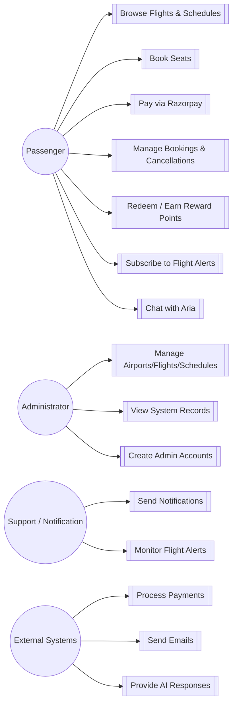
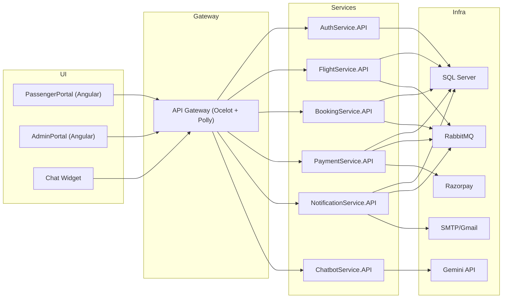
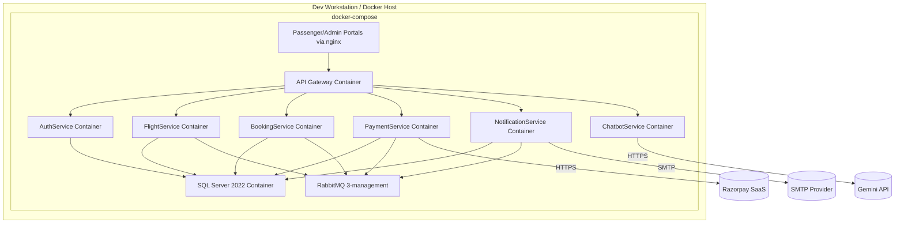
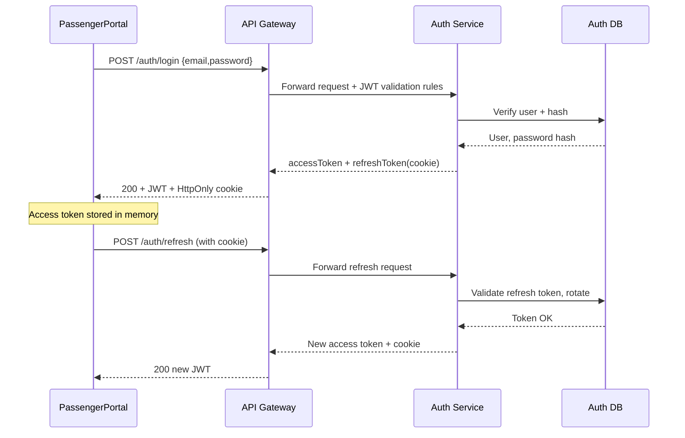
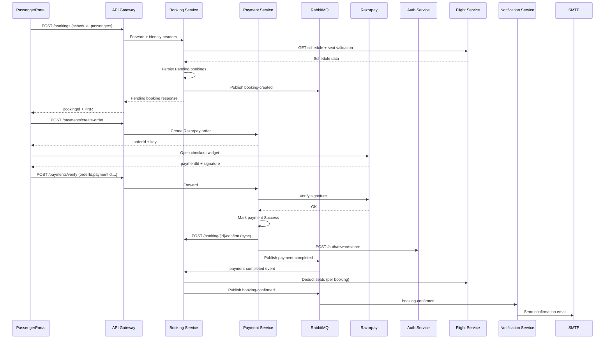
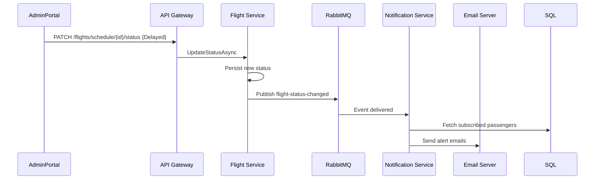
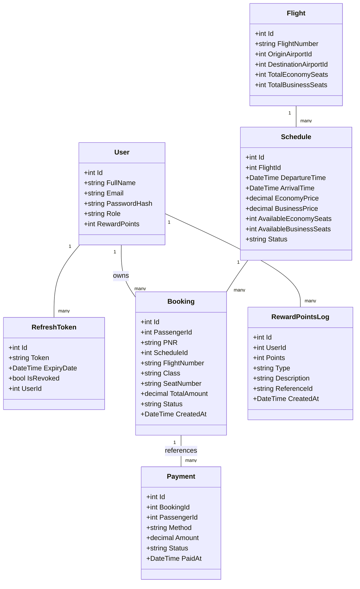
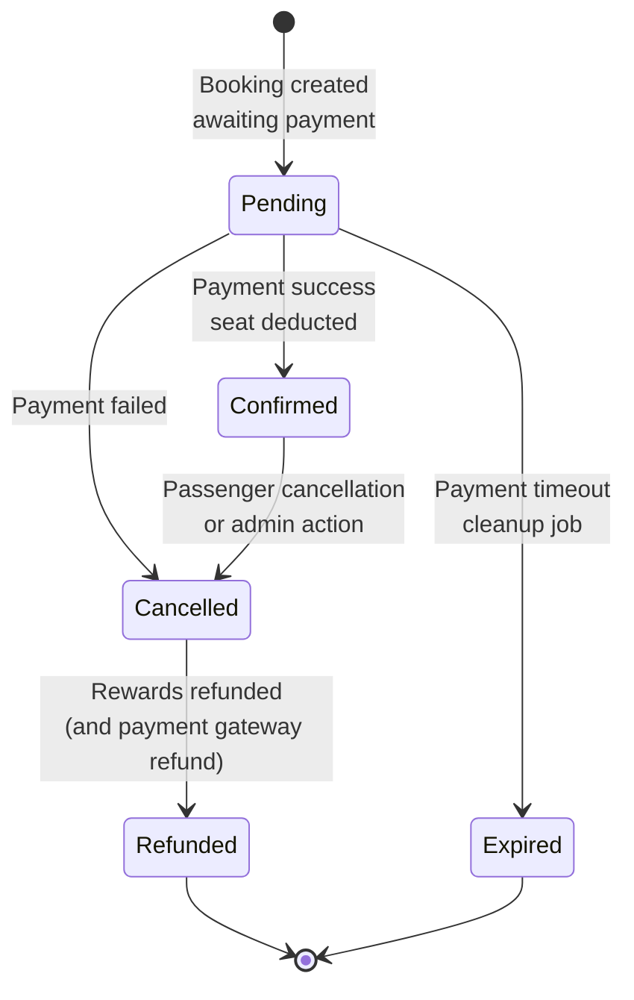
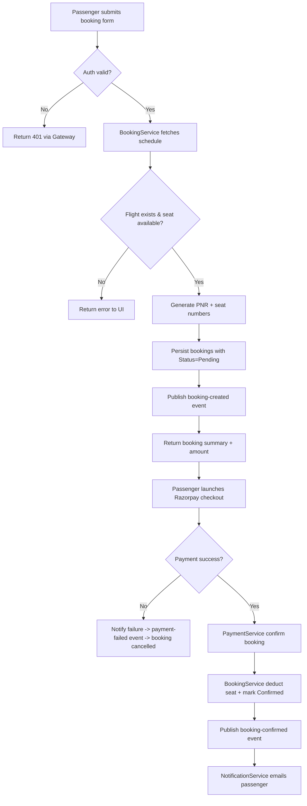

# AirlineApp – Low Level Design (LLD)

This document complements the HLD by detailing flows, data structures, and runtime interactions for AirlineApp. It covers use cases, components, deployment targets, key sequences, core classes, state transitions, and activities that matter for engineers and testers.

---

## 1. Use Cases

---

## 2. Component View

---

## 3. Deployment View

---

## 4. Sequence Diagrams

### 4.1 Authentication (Login + Refresh)

### 4.2 Booking + Payment Saga

### 4.3 Flight Status Alert

---

## 5. Core Classes & Data Model

---

## 6. Booking State Diagram

---

## 7. Activity Diagram – Booking Creation & Seat Assignment

---

## 8. Detailed Component Responsibilities

| Component | Internal Structure | Key Interfaces | Notes |
|-----------|-------------------|----------------|-------|
| **AuthService** | Controllers (`AuthController`), services (`AuthServiceImpl`, `TokenService`, `AuthEmailService`), EF `AuthDbContext` | `/api/auth/*` endpoints, reward HTTP APIs for Booking/Payment, SMTP | Handles refresh-token rotation, reward ledger, admin management, forgot/reset flows |
| **FlightService** | Controllers for `Airport`, `Flight`, `Schedule`; `ScheduleServiceImpl` coordinating seat inventory; RabbitMQ publisher | `/api/airport`, `/api/flight`, `/api/schedule` plus seat adjust endpoints | Publishes `flight-status-changed`, exposes search & seat deduction APIs for booking saga |
| **BookingService** | `BookingController`, `BookingServiceImpl`, HTTP client for Flight, `RabbitMQPublisher`, background consumers (payment events, cleanup) | `/api/booking/*`, RabbitMQ queues, Auth reward refund HTTP | Implements seat locking, price logic, mass-passenger handling, occupancy query, saga orchestrator |
| **PaymentService** | `PaymentController`, `RazorpayService`, RabbitMQ publisher/consumer, `PaymentDbContext` | `/api/payment/*`, Razorpay API, Booking/Auth HTTP, RabbitMQ | Persists payment attempts, handles verification, compensates booking status |
| **NotificationService** | `AlertController`, `EmailService`, `NotificationEventConsumer`, `NotificationDbContext` | `/api/alert/*`, SMTP, RabbitMQ | Stores subscriptions, generates HTML emails, ensures retries via consumer ack |
| **ChatbotService** | FastAPI app, session store, Gemini integration helpers | `/api/chatbot/questions`, `/api/chatbot/message`, Flight/Booking HTTP, Gemini API | Collects live data, crafts prompts, enforces session caps, CORS open for frontend |
| **API Gateway** | Ocelot config, JWT middleware, RetryDelegatingHandler, NLog | `/auth`, `/flights`, `/bookings`, `/payments`, `/notifications`, `/chatbot` upstream routes | Injects `X-User-*` headers, central authorization, cross-origin control |

---

## 9. Data Persistence & Transactions

- **Transaction boundaries:** Each service keeps local transactions (EF Core `SaveChanges`). Cross-service consistency achieved via saga events; seat deduction occurs within BookingService after confirming seats via FlightService HTTP call.
- **Idempotency:** Event consumers check booking/payment status before mutating (e.g., `UpdateBookingStatusAsync` short-circuits if status unchanged). Payment verification polls DB until payment record exists to avoid race conditions.
- **Cleanup:** BookingService `BookingCleanupService` (not depicted above) scans for expired pending bookings and releases seats; NotificationService uses soft deletes for alert subscriptions.

---

## 10. Extensibility Hooks

- **Event versioning:** Shared.Events library organizes DTOs; any breaking change requires versioned event names.
- **Adapters:** Additional payment providers or notification channels can integrate by extending publisher/subscriber patterns.
- **Observability:** NLog currently outputs to files/console; instrumentation (OpenTelemetry) can be layered on with minimal disruption thanks to centralized logging bootstrapping.

